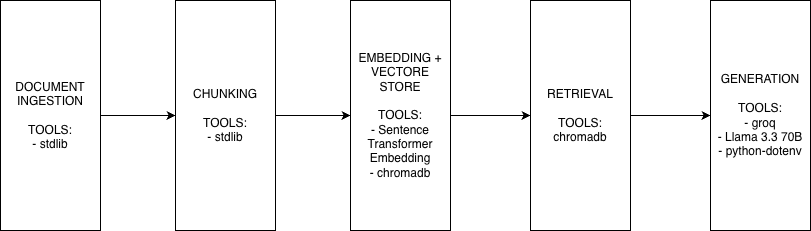

# Project 1 Planning: The Unofficial Guide

> Write this document before you write any pipeline code.
> Your spec and architecture diagram are what you'll use to direct AI tools (Claude, Copilot, etc.) to generate your implementation — the more specific they are, the more useful the generated code will be.
> Update the Retrieval Approach and Chunking Strategy sections if you change your approach during implementation.
> Update this file before starting any stretch features.

---

## Domain

<!-- What domain did you choose? Why is this knowledge valuable and hard to find through official channels? -->
UCSD Social Life

Official guides usually contain administrative items, academic policies, and safety protocols. Unofficial guides are run by students that shows what social life is actually like on the ground from the perspective of current students or alumni.

---

## Documents

<!-- List your specific sources: URLs, subreddit names, forum threads, or file descriptions.
     Aim for at least 10 sources that together cover different subtopics or perspectives within your domain. -->

| # | Source | Description | URL or location |
|---|--------|-------------|-----------------|
| 1 | Google Doc | A freshmen survival guide created and updated by UCSD students and alumni. It contains a section on the socializing aspect of UCSD (Partying and Events). | https://docs.google.com/document/u/2/d/1Ne92VhDUGj-fnjg7e-Brc5d1ESInk9GASr2sIHWLbHA/mobilebasic# |
| 2 | Reddit | Redditors talked about UCSD's muted social life especially compared to party schools. | https://www.reddit.com/r/UCSD/comments/1hoe5p4/social_life_at_ucsd/?rdt=58712 |
| 3 | UCSD Guardian | Despite the UC Socially Dead reputation, many students and administrators found social life through the new transit system, college communities, sports, and student initiatives. | https://ucsdguardian.org/2022/04/03/the-uc-socially-dead-stigma/ |
| 4 | Youtube | A former student talked about social life at UCSD. | https://www.youtube.com/watch?app=desktop&v=fCBZmONxAhk |
| 5 | Reddit | Redditors discuss UCSD social life and whether the UC socially dead meme is true. | https://www.reddit.com/r/UCSD/comments/thcbhl/ucsd_social_life/ |
| 6 | Reddit | There are various social events at UCSD such as Bear Garden, meet the beach, and more. | https://www.reddit.com/r/UCSD/comments/wyk39g/when_you_guys_think_of_socializing_events_at_ucsd/ |
| 7 | Quora | Quora users talked about their life at UCSD including things to do and social aspect. | https://www.quora.com/What-is-student-life-like-at-UCSD |
| 8 | Triton News | Different places and activity groups where UCSD students can socialize and make friends. | https://triton.news/2023/11/six-ways-to-make-friends-on-campus-and-counter-the-uc-socially-dead-narrative/ |
| 9 | collegeVine | CollegeVine expert gave an overview of UCSD and dismissed UCSD's "socially dead" label. | https://www.collegevine.com/faq/92983/university-of-california-san-diego-what-s-campus-life-like |
| 10 | plexuss | Q&A response of what life is like on campus. | https://plexuss.com/f3/university-of-california-san-diego-campus-life-residence-halls |

---

## Chunking Strategy

<!-- How will you split documents into chunks?
     State your chunk size (in tokens or characters), overlap size, and explain why those
     numbers fit the structure of your documents.
     A review-heavy corpus warrants different chunking than a long FAQ. -->

**Strategy:** Recursive chunking

**Chunk size:** 256

**Overlap:** 64

**Reasoning:** My data is forum-heavy, where individual comments are short independent opinions. A blind fixed-size chunk would slice across different comments, merging unrelated (and possibly opposing) voices into one chunk. Instead, I pre-segmented each sourcce with "---" markers between logical units (one comment, one topic, etc.). The recursive splitter first spits on the delimiters. If a segment exceeds 256 tokens, then it fall back to a fixed-size window. This preserves the integrity of commenter's perspective.

---

## Retrieval Approach

<!-- Which embedding model are you using (e.g., all-MiniLM-L6-v2 via sentence-transformers)?
     How many chunks will you retrieve per query (top-k)?
     If you were deploying this for real users and cost wasn't a constraint, what tradeoffs
     would you weigh in choosing a different embedding model — context length, multilingual
     support, accuracy on domain-specific text, latency? -->

**Embedding model:** all-MiniLM-L6-v2

**Top-k:** 5

**Production tradeoff reflection:** The documents retrieved are manually extracted and organized, so it would not work in a production setting at scale. For forum sources like Reddit and Quora, the API return the data in a structure way separated by comment so there is no need for custom web scrappers or data wrangling. For blogs, videos, or other web sources, a custom web scrapper is needed to clean the data.

If this is deployed for real users and cost is not a constraint, I would upgrade to all-mpnet-base-v2 or text-embedding-3-small (OpenAI). The key tradeoffs to weigh are:

_Accuracy on domain-specific text_ – UCSD social life discussions use campus slang ("Geisel," "Sixth College," "Price Center"). all-MiniLM-L6-v2 sometimes misses semantic nuance in conversational text. A larger model like mpnet improves recall for queries like "How do commuters make friends?"

_Context length_ – The max token for all-MiniLM-L6-v2 is 256 tokens, which works nicely for all of the documents that are preprocessed. For sources that are longer (> 256 tokens) and cannot be split into smaller logical units, a larger model like text-embedding-3-small would be necessary.

_Latency vs. quality_ – all-MiniLM-L6-v2 runs at ~10ms/query locally. mpnet takes ~30–50ms. For real users, 50ms is still imperceptible, so the accuracy gain likely justifies the latency tradeoff.

_Multilingual support_ – Not relevant for this English-only corpus. Since students are attending UCSD, they should be proficient in English.

_Deployment environment_ – Without cost constraints, I'd also consider a reranking step (e.g., cross-encoder/ms-marco-MiniLM-L-6-v2) after initial retrieval to reorder top-k chunks by relevance. This adds latency but significantly improves answer quality for Q&A.

Bottom line: Cost-no-object production system = text-embedding-3-small + cross-encoder reranker + k=10 (reranked to top-5). But for a local pipeline, all-MiniLM-L6-v2 with k=5 is a practical, fast, and sufficient baseline.

---

## Evaluation Plan

<!-- List your 5 test questions with their expected correct answers.
     Questions should be specific enough that you can judge whether the system's response
     is right or wrong. "What are good dining halls?" is too vague.
     "What do students say about wait times at [dining hall name] during lunch?" is testable. -->

| # | Question | Expected answer |
|---|----------|-----------------|
| 1 | When does fraternity and sorority recruitment happen at UCSD, and how do they differ? | Sorority formal recruitment is week 1 of fall quarter (some informal recruitment in winter/spring, but not all). Fraternity rush is week 2 of both fall and spring quarter (a few do informal rush in winter; most don't). |
| 2 | Where do students find parties at UCSD, both on and off campus? | On campus, parties are found at International House (I-House) in ERC and the Village (transfer housing); both are exclusive, so you need to know the hosts. Off campus, parties are found at fraternities/sororities/social orgs, since UCSD has no frat row; some students also live and party in Pacific Beach. |
| 3 | What happens at a Bear Garden event? | An outdoor mini-carnival at Matthews Quad, held once or twice a quarter on a Friday afternoon. Everything is free: food from 2–3 vendors, free beer / hard apple cider for those 21+, and carnival games you play for prizes. Lines get long. |
| 4 | Why does UCSD have the "UC Socially Dead" reputation? | Relaxed, wealthy La Jolla location with no college town; constant comparison to nearby party school SDSU; no football team (less school-spirit anchor); ~50 frats/sororities but no frat row; a STEM-heavy, academically driven student body; a commuter-heavy campus (only ~39% of students housed on campus); and a college system that can isolate students within their own college. |
| 5 | According to students, what is the most recommended way to build a social life at UCSD? | The overwhelming consensus is to join clubs, orgs, and club sports and to take personal initiative ("put yourself out there"). UCSD is social if you seek it out. Specific free on-campus social hubs include Tritons Roll Out (roller skating), Groundwork Books, Company 157 (theater), The Che Café (music venue), MOM's Café (open-mic), and The Loft at Price Center. |

---

## Anticipated Challenges

<!-- What could go wrong? Name at least two specific risks with reasoning.
     Consider: noisy or inconsistent documents, missing source attribution, off-topic
     retrieval, chunks that split key information across boundaries. -->

1. The sources are made of mainly short independent comments. Using a fixed chunk size that is too large might combine opposing opinions together creating a noisy chunk.

2. Longer text like the Google Doc document will be harder to chunk with fixed size chunking. If the size is not large enough, the surrounding context will be lost.

---

## Architecture

<!-- Draw a diagram of your pipeline showing the five stages:
     Document Ingestion → Chunking → Embedding + Vector Store → Retrieval → Generation
     Label each stage with the tool or library you're using.
     You can use ASCII art, a Mermaid diagram, or embed a sketch as an image.
     You'll use this diagram as context when prompting AI tools to implement each stage. -->

---

## AI Tool Plan

<!-- For each part of the pipeline below, describe:
     - Which AI tool you plan to use (Claude, Copilot, ChatGPT, etc.)
     - What you'll give it as input (which sections of this planning.md, which requirements)
     - What you expect it to produce
     - How you'll verify the output matches your spec

     "I'll use AI to help me code" is not a plan.
     "I'll give Claude my Chunking Strategy section and ask it to implement chunk_text()
     with my specified chunk size and overlap" is a plan. -->

**Milestone 3 — Ingestion and chunking:**
I'll give Claude my Chunking strategy and ask it to implement chunk_document() and any helper functions to help with it. I am expecting it to chunks of object, where each contains the document's metadata, the text, and chunk id. I will print the output and see if it matches the expected shape.

**Milestone 4 — Embedding and retrieval:**
I'll give Claude my Retrieval approach and ask it to implement embed_and_store() and retrieve(). I expect it to store the chunks in chromadb, and it can retrieve the top k chunks that is most related to the query. I will print the number of chunks and their distance.

**Milestone 5 — Generation and interface:**
I'll give Claude my Response Quality section and the chunk-dict shape and ask it to implement generate_response() so it builds a source-labeled context block ([Source 1 — Reddit]), uses a system prompt that answers strictly from context, names the source, and says "isn't covered in the documents" when context is thin — at temperature=0.2, handling the empty-chunks case before the model call. Then I'll ask it to wire chat(message, history) in app.py to call retrieve() then generate_response() inside the Gradio ChatInterface.